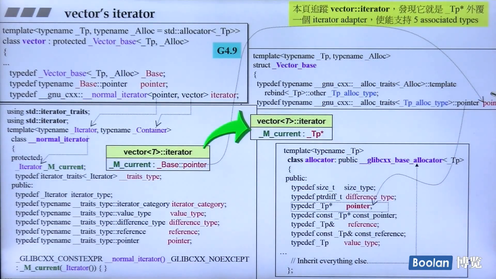

# STL标准库和泛型编程

所谓Generic Programming(GP，泛型编程)，就是使用template(模板)为主要工具来编写程序。

> 使用一个东西，
>
> 却不明白它的道理，
>
> 不高明！


## 认识headers、版本、重要资源

> C++ Standardf Library (C++ 标准库)
>
> **S**tandard **T**emplate **L**ibrary (STL，标准模板库)


### 标准库以header files形式呈现

* C++标准库的header files不带扩展名(.h)，例如 `#include <vector>`
* 新式C header files不带扩展名(.h)，例如 `#include <cstdio>`
* 旧式C header files(带有扩展名.h)仍然可用，例如 `#include <stdio.h>`
* 新式headers内的组件封装于namespace "std"
  * using namespace std;
  * using std::cout; 
* 旧式header内的组件不封装于namespace "std"


### C++标准库参考网站

* [www.cplusplus.com](www.cplusplus.com)
* [www.cppreference.com](www.cppreference.com)
* [gcc.gnu.org](gcc.gnu.org)


## STL体系机构基础介绍

### STL六大部件(Components):

* 容器(Containers)
* 分配器(Allocators)
* 算法(Algorithms)
* 迭代器(Iterators)
* 适配器(Adapters)
* 仿函式(Functors)


### 六大部件之间的关系


**容器**解决了管理内存的问题，所以它需要**分配器**来做支撑，对数据所做的操作被写成了模板函数放在了**算法**中，而**迭代器**作为容器和算法之间的桥梁，是一种泛化的指针，供算法操作容器中的数据。**仿函式**向算法解释容器中数据与操作之间的关系&规则，供算法去调用。**适配**器能够对容器、算法、仿函数进行转换，从而使其于其他组件适配。


### 代码示例及解释

```cpp
#include <vector>
#include <algorithm>
#include <functional>
#include <iostream>

using namespace std;

int main() {
    int ia[6] = {27, 210, 12, 47, 109, 83};
    vector<int,allocator<int>> vi(ia,ia+6);
    cout << count_if(vi.begin(), vi.end(),
            not1(bind2nd(less<int>(), 40)));
    return 0;
}
```

上面的代码中`vector`就是一个**容器**，vector后的尖括号中，第一个参数`int`指明了容器中元素的数据类型，第二个参数`allocator<int>`为容器配置了一个**分配器**，用于分配内存，并且这个分配器也是一个模板，也要写明分配的内存的数据类型。

`count_if`则是一个**算法**，参数列表的前两项就是**迭代器**，即`vi.begin()`和`vi.end()`。

`not1`和`bind2nd`均为仿函式**适配器**，前者对运行结果进行取反操作，后者会将仿函式的第二个参数进行了绑定，像上面的`less<int>()`有两个参数A、B，该函数会返回A小于B的结果，而`bind2nd`就将40绑定到了第二个参数B上，再通过`not1`将结果取反。

所以算法`count_if`会通过给定的容器的迭代器，获取容器中的数据，并结合适配器修饰后的仿函式执行算法，上述代码的结果就是求出容器中大于等于40的元素个数。


### "前闭后开" 区间

上面介绍到的迭代器`vi.begin()`和`vi.end()`，第一个begin()指向容器的第一个元素，而end()指向的是最后一个元素的下一个位置，所以对于一个容器来说，可以用数学中的“前闭后开”区间，生动形象地形容它迭代器`begin()`和`end()`框出的容器范围。

**用迭代器遍历一个容器中的所有元素**

```cpp
Container<T> c;
Container<T>::iterator ite = c.begin();
for (; ite != c.end(); ++ite)
	...
```

这是C++原始的写法，显示地用`Container<T>::iterator`去声明一个迭代器`ite`，然后再利用`++`运算符不断将迭代器移向下一个位置，直到遇见了迭代器`end()`，而在C++11中，提供了基于范围的for循环遍历，代码如下：

```cpp
std::vector<double> vec;
for ( auto elem : vec) {
	std::cout << elem << std::endl;
}
for ( auto& elem : vec) {
	elem *= 3;
}
```

 上面的`auto`关键字能够自动地识别变量的数据类型，从而精简代码，而第二个for循环中，只有通过`auto&`，加上引用才能够做到修改容器中的数据，否则`elem`就只是容器中一个元素的拷贝，for循环中的语句将不会对容器中的数据产生任何影响。


## 容器-结构与分类

容器的分类大致上分为两种，一种是**序列式容器(Sequence Containers)**，另一种是**关联式容器(Associative Containers)**。

关联式容器，是通过键值对来存储数据，因为用key来找东西很快，所以很适合用来查找数据。

除了上面的两种容器，还有第三种容器叫**不定序容器(Unordered Containers)**，是C++11所新增加的，其底层是用哈希表实现的。


###  序列式容器

#### array

array是C++11新增加的一个封装数组，在生成实例对象时就申请了固定的一块内存，后续是无法发生改变的。

在使用array时需要传入两个参数，一个是存储元素的数据类型，另一个是个常量，固定容器的大小。

然后生成随机数塞入array容器中，并用clock()函数计算存储数据所用的时间，和快速排序及二分查找的时间。

```cpp
#include <iostream>
#include <array>
#include <ctime>

using std::cin;
using std::cout;
using std::endl;
using std::string;

const int ASIZE = 500000;

long get_a_target_long() {
    cout << "please input a target number: ";
    long target;
    cin >> target;
    return target; 
}

int compareLongs(const void* a, const void* b) {
    return (*(long*)a - *(long*)b);
}

namespace jj01 {

void test_array() {
    cout << "test_array()..............\n";
    
    std::array<long,ASIZE> c;
    
    clock_t timeStart = clock();
    for(int i=0; i < ASIZE; ++i) {
        c[i] = rand();
    }
    cout << "milli-seconds: " << (clock() - timeStart) << endl;
    cout << "array.size()= " << c.size() << endl;
    cout << "array.front()= " << c.front() << endl;
    cout << "array.back()= " << c.back() << endl;
    cout << "array.data()= " << c.data() << endl;

    long target = get_a_target_long();
    
    timeStart = clock();
    std::qsort(c.data(), ASIZE, sizeof(long), compareLongs);
    long* pItem = (long*) std::bsearch(&target, (c.data()), ASIZE, sizeof(long), compareLongs);
    cout << "qsort() + bsearch(), milli-seconds: " << (clock() - timeStart) << endl;
    if(pItem != NULL)
        cout << "found, " << *pItem << endl;
    else
        cout << "not found!" << endl;
}

}

int main() {
    jj01::test_array();
    return 0;
}
/* 运行结果
test_array()..............
milli-seconds: 23
array.size()= 500000
array.front()= 41
array.back()= 29794
array.data()= 0x437a84
please input a target number: 20000
qsort() + bsearch(), milli-seconds: 57
found, 20000
*/
```

#### vector

vector容器支持动态内存扩充，在声明一个容器后，通过调用vector的`capacity()`函数可知，容器当前分配的内存空间为0，在`push_back()`一个元素后，它分配的内存空间就变为了1，通过不断的插入元素、输出已分配的内存空间数，可以发现，vector在没有空间可以容纳新元素时，会申请自身两倍的内存空间，即如果当前vector中有16个元素，再插入一个新的元素后，vector会申请32个内存空间， 然后把原先的16个元素全部转移过去，再插入第17个元素，随后直到容器插入第33个元素时，会再申请64个内存空间用于容纳新的元素。

以下代码演示了vector的测试过程，同样是测试插入元素和查找元素的速度：

```cpp
string get_a_target_string() {
    cout << "please input a target number: ";
    long target;
    cin >> target;
    char buf[10];
    snprintf(buf, 10, "%d", target);
    return string(buf); 
}

int compareStrings(const void* a, const void* b) {
    if( *(string*)a > *(string*)b) return 1;
    else if( *(string*)a < *(string*)b) return -1;
    else return 0;
}

namespace jj02 {

void test_vector() {
    cout << "test_vector()........\n";
    cout << "How many numbers? ";
    long value;
    cin >> value;

    std::vector<string> c;
    char buf[10];
    
    clock_t timeStart = clock();
    for(long i=0; i < value; ++i) {
        try {
            snprintf(buf, 10, "%d", rand());
            c.push_back(string(buf));
        }
        catch(exception& p) {
            cout << "i= " << i << " " << p.what() << endl;
            abort();
        }
    }
    cout << "milli-seconds: " << (clock() - timeStart) << endl;
    cout << "vector.size()= " << c.size() << endl;
    cout << "vector.front()= " << c.front() << endl;
    cout << "vector.back()= " << c.back() << endl;
    cout << "vector.data()= " << c.data() << endl;
    cout << "vector.capacity()= " << c.capacity() << endl;
    
    string target = get_a_target_string();
    {
    timeStart = clock();
    auto pItem = std::find(c.begin(), c.end(), target);
    cout << "::find(), milli-seconds= " << (clock() - timeStart) << endl;
    if(pItem != c.end())
        cout << "found, " << *pItem << endl;
    else
        cout << "not found!" << endl;
    }
    {
    timeStart = clock();
    std::sort(c.begin(), c.end());
    string* pItem = (string*)bsearch(&target, (c.data()), c.size(), sizeof(string), compareStrings);
    cout << "sort() + bsearch(), milli-seconds= " << (clock() - timeStart) << endl;  
    if(pItem != NULL)
        cout << "found, " << *pItem << endl;
    else
        cout << "not found!" << endl;
    }
}

}
/*
test_vector()........
How many numbers? 100000
milli-seconds: 346
vector.size()= 100000
vector.front()= 41
vector.back()= 1629
vector.data()= 0x14e0020
vector.capacity()= 131072
please input a target number: 23456
::find(), milli-seconds= 7
found, 23456
sort() + bsearch(), milli-seconds= 115
found, 23456
*/
```

#### list

list容器是一个双向链表， 在插入一个元素后，它就会申请一块相应大小的内存空间，所以内存的扩充是很缓慢的，并不像vector会造成空间的浪费，在插入元素操作上是非常快的，但相应的也就无法实现随机存取。

#### forward_list

forward_list是C++11新增加的一个单向链表容器，其设计目标是达到与最好的手写单向链表数据结构相当的性能，仅提供`push_front()`函数用于将新元素插入链表的头部，因为将元素插入链表的尾部这个操作是极其的缓慢的，它不能够实现随机存取。需要注意的是它没有`size()`函数用于查看链表中元素的个数，因为保存或计算其大小会比手写链表多出额外的开销

#### deque

deque是一个双端队列，能够从前后插入新元素，其实现是由一连串一连串的内存拼接而成，在往前或往后无法插入新元素后，deque会申请一连串内存用于容纳新的元素。而deque对外“宣称”它是一整块连续的内存，并能够实现随机存取，但其实这仅仅是一种假象。

#### queue & stack

queue和stack，一个能够做到“一端进另一端出”，一个能够做到“一端进同一端出”，其功能是deque的子集，所以在其实现上是对deque双端队列的再一次封装，所以有人认为queue和stack不应该被认定为容器，而是一个容器的适配器(Container Adapter)。


### 关联式容器

#### set & map

set和map底层都提供了排序功能，红黑树形式存储的键值是有序的。

#### multiset & multimap

相比于上面的set和map，multiset和multimap允许插入相同的key，即对于multiset来说，不会对相同的元素去重，相同的key都会被储存下来，而对于multimap来说，同一个key值，可以映射到多个value上，这样的话，multimap就不能做到像map那样用`[ ]`运算符传入key来访问value。


### 不定序容器

#### unordered_set & unordered_map & unordered_multiset & unordered_multimap

带有unordered前缀的容器都是采用哈希表来实现数据的存储，要注意的是对于这些特殊的容器，包括之前提到的list和forward_list，它们自身会提供一些成员函数，如sort()或find()，相比于STL提供的统一的std::find()和std::sort()函数要更加的快速，因为其根据存储的不同特点重写了更优的算法，所以对于重复功能的函数，优先选择容器自带的函数。


## 分配器及其使用

对于一个分配器，它最重要的作用就是申请和释放内存，对应的方法就是`allocator`和`deallocator`，从下面的VC6所附标准库的源码看来，它的`allocator`和`deallocator`调用了`operator new`和`operator delete`方法，而这两个方法最终也是调用了C的`malloc`和`free`函数，所以说分配器是对`malloc`和`free`的封装再封装。

``` cpp
template <class _Ty>
class allocator {
public:
    typedef _SIZT size_type;
    typedef _PDFT difference_type;
    typedef _Ty _FARQ *pointer;
    typedef _Ty value_type;
    pointer allocate(size_type _N, const void *) {
        return (_Allocator((difference_type)_N, (pointer)0));
    }
    void deallocator(void _FARQ *_P, size_type) {
		operator delete(_P);
    }
}
=============================================================
//上面用到的_Allocator定义
template <class _Ty> inline
_Ty _FARQ *_Allocator(_PDFT _N, _Ty _FARQ *) {
    if(_N < 0) _N = 0;
    return ((_Ty _FARQ *)operator new((_SIZT)_N * sizeof(_Ty)));
}
=============================================================
// operator new对malloc的封装
// ...\vc98\crt\src\newop2.cpp
void *operator new(size_t size, const std::nothrow_t&) _THROW0() {
    void *p;
    while((p=malloc(size))==0) {
        _TRY_BEGIN
		if(_callnewh(size)==0) break;
        _CATCH(std::bad_alloc) return(0);
        _CATCH_END
    }
    return (p);
}
// <new.h> of CB5
inline void* _RTLENTRY operator new(size_t size, const std::nothrow_t&) {
    size = size ? size : 1;
    return malloc(size);
}
```

对于每个容器，我们是看不到其背后的内存分配过程的，因为容器作为一个工具，使用者不用去关注到其内存是如何分配的，这些工作全部转交给分配器去完成，甚至在声明一个容器时，都不用选择分配器，而是采用默认的分配器去执行。

如下是容器vector的模板头代码

```cpp
template < class T, class Alloc = allocator<T> > class vector;
```

后面的`allocator<T>`会根据用户输入的数据类型自动生成分配器

如果想要使用`std::allocator`以外的`allocator`，得自行`#include <ext\...>`， 如下(GNU环境下)：

```cpp
#include <ext\array_allocator.h>
#include <ext\mt_allocator.h>
#include <ext\debug_allocator.h>
#include <ext\pool_allocator.h>
#include <ext\bitmap_allocator.h>
#include <ext\malloc_allocator.h>
#include <ext\new_allocator.h>
```

分配器在使用时，申请要传入申请的内存数量，释放内存时也要传入内存数量。这对于编程来说是不合理的，一般我们不会去直接使用分配器。使用的例子如下。

```cpp
int* p;
std::allocator<int> alloc1;
p = alloc1.allocate(1);
*p = 233;
cout << *p << endl;
alloc1.deallocate(p,1);
```

## OOP vs GP

> OOP(Object-Oriented Programming，面向对象编程)
>
> GP(Generic Programming，泛型编程) 

OOP企图将datas和methods联系在一起，形成一个类，而GP则是想让它们结合起来。在C++标准模板库中，OOP的思想不是很明显，没有很多的继承和虚函数。

采用GP有两个优点：

* Containers和Algorithms团队可以各自闭门造车，其中以Iterator沟通即可。
* Algorithms通过Iterator确定操作范围，并通过Iterator却用Container元素。

举个例子，下面两份代码，一份是两个容器(vector和deque)，另一份是排序算法的函数头代码。

```cpp
template < class T, class Alloc = allocator<T> >
class vector {...};
template < class T, class Alloc = allocator<T> >
class deque {...};
```

这两个容器都提供 RandomAccessIterator(随机访问存储器)。

```cpp
template <class RandomAccessIterator>
void sort (RandomAccessIterator first, RandomAccessIterator last) {...}
template <class RandomAccessIterator, class Compare>
void sort (RandomAccessIterator first, RandomAccessIterator last, Compare comp) {...}
```

从sort的参数列表来看，我们只需要传入两个随机访问存储器，就可以完成对容器中数据的排序，如`::sort(c.begin(),c.end())`。另外可以注意到存在第三个参数`Compare`，它的作用是传入一个仿函式(Functor)，用于对一些数据的大小关系进行定义。

下面我们就来利用仿函式定义一下字符串之间的大小关系。

```cpp
template <class T> 
const T& max (const T& a, const T& b) {
    return a < b? b : a;
}
template <class T, class Compare>
const T& max (const T& a, const T& b, Compare comp) {
    return comp(a, b) ? b : a;
}
bool strLonger(const string& s1, const string& s2) {
    return s1.size() < s2.size();
}
cout << "max of zoo and hello: " << max(string("zoo"), string("hello")) << endl; // zoo
cout << "max of zoo and hello: " << max(string("zoo"), string("hello"), strLonger) << endl; // hello
```

上面的代码第一个输出是`zoo`，因为max会使用string类中的运算符`operator <`来比较两个字符串的大小，默认是按字典序排，所以zoo比hello要大。第二个输出是`hello`，因为我们传入了一个仿函式`strLonger`，算法会根据仿函式的逻辑执行，在strLonger中我们认为字符串大小由其长度决定，故输出的是较长的hello。


## 运算符重载 & 模板

> Operator Overloading 操作符重载
>
> Template 模板


### 运算符重载

运算符重载可以让我们更好的去设计一个工具的各种行为，例如迭代器本身是一个泛化的指针，那么我们就需要去重载它的`*`、`->`、`++`运算符等等，下面是一部分源码：

```cpp
template <class T, class Ref, class Ptr>
struct __list_Iterator {
    typedef __list_Iterator<T, Ref, Ptr> self;
    typedef bidirectional_iterator_tag iterator_category;
    typedef T value_type;
    typedef Ptr pointer;
    typedef Ref reference;
    typedef __list_node<T>* link_type;
    typedef ptrdiff_t difference_type;
    
    link_type node;
    
    reference operator*() const { return (*node).data; }
    pointer operator->() const  { return &(operator*()); }
    self& operator++() 			{ node = (link_type)((*node).next); return *this; }
    self operator++(int) 		{ self tmp = *this; ++*this; return tmp; }
    ...
};
```

在重载运算符时，可以是成员函数，也可以是非成员函数，规则如下：

| Expression | As member function | As non-member function     |
| ---------- | ------------------ | -------------------------- |
| @a         | (a).operator@( )   | operator@(a)               |
| a@b        | (a).operator@(b)   | operator@(a,b)             |
| a=b        | (a).operator=(b)   | :fire:cannot be non-member |
| a[b]       | (a).operator[](b)  | :fire:cannot be non-member |
| a->        | (a).operator->( )  | :fire:cannot be non-member |
| a@         | (a).operator@(0)   | operator@(a,0)             |


### 类模板

阅读C++标准库需要的另一个基础就是模板，下面是一个描述复数的模板类，对于的一个复数拥有实部和虚部，它可以是浮点数，也可以是个整数。我们在设计的时候可以不用去考虑它实虚部的数据类型，而是在类前面用`template <class T>`来生成一个模板，实部和虚部的数据类型用`T`去表示。这样的话，我们在实际使用时，用类名加尖括号`< >`，尖括号中写入数据类型，那么程序就会根据模板去生成对应的类。

```cpp
template <class T>
class complex {
public:
    complex(T r = 0, T i = 0) : re(r), im(i) {}
    complex& operator += (const complex&);
    T real() const { return re; }
    T imag() const { return im; }
private:
    T re, im;
    friend complex& __doapl (complex*, const complex&);
};
========================================================
{
    complex<double> c1(2.5, 1.5);
    complex<int> c2(2, 6);
    ...
}
```


### 函数模板

函数模板和类模板相似，就是在函数头前通过`template <class T>`泛指一个数据类型。下面是一个求最小的stone的部分程序，通过调用min函数获取结果，min函数实际上是一个函数模板，在传入参数r1、r2后，编译器对函数模板进行实参的推导。

```cpp
stone r1(2,5), r2(3,3), r3;
r3 = min(r1,r2);
```

函数模板如下，实参推导的结果是`T`为`stone`，于是调用了实参`b`的`stone::operator<()`。

```cpp
template <class T>
inline
const T& min(const T& a, const T& b) {
	return b < a ? b : a;
}

class stone {
public:
    stone(int w, int h, int we): _w(w), _h(h), _weight(we) {}
    bool operator< (const stone& rhs) const {
        return _weight < rhs._weight;
    }
private:
    int _w, _h, _weight;
};
```


### 模板的泛化 & 特化 & 偏特化

上面的类模板和函数模板的代码示例都属于是模板的泛化，而有的时候，并不是对于所有的数据类型，都可以用同一份代码去实现。所以引入了模板的特化，我们能够通过对某一特定类型编写特定的代码去执行，有时候是迫不得已，有时候则是为了优化性能。

下面代码展示了模板的特化，其写法是把前面的`template<class type>`尖括号中的类型去掉，并在模板头后加入`<type>`，type是特定的数据类型。

```cpp
// 泛化
template <class type>
struct __type_traits {
    typedef __true_type this_dummy_member_must_be_first;
    typedef __flase_type has_trivial_default_constructor;
    ...
};
// 特化
template<> struct __type_traits<int> {
    typedef __true_type has_trivial_default_constructor;
    ...
};
template<> struct __type_traits<double> {
    typedef __true_type has_trivial_default_constructor;
    ...
};
```

偏特化和特化类似，有人也称其为局部特化，也就是说，特化的是模板类型中的一部分，如下代码中vector后偏特化了bool类型，编译器在收到bool参数时会优先选择偏特化的模板，其中我们能够去依据bool类型的特性去优化代码性能。

```cpp
// 泛化
template <class T, class Alloc = alloc>
class vector {...};
// 偏特化
template <class Alloc>
class vector<bool,Alloc> {...};
```

上面的偏特化是对**数据类型**的偏特化，我们还可以对**结构**进行偏特化。

如下代码指针类型和常量指针类型：

```cpp
// 泛化
template <class Iterator>
struct iterator_traits {
    typedef typename Iterator::iterator_category iterator_category;
    ...
}
// 偏特化
template <class T>
struct iterator_traits<T*> {
    typedef random_access_iterator_tag iterator_category;
    ...
}
// 偏特化
template <class T>
struct iterator_traits<const T*> {
    typedef random_access_iterator_tag iterator_category;
    ...
}
```


## 深度探索List


上图的左边展示的是List双向链表的结构，每个节点都有两个指针，分别指向了它的上一个节点和下一个节点，但于一般的链表不同的是，它刻意地添加了一个空白节点，将链表的头尾连接起来形成一个环状的双向链表，并让迭代器end()指向这个空白节点，用以符合之前讲到的“前闭后开”区间的设计。

同时从右边的代码可以发现，在设计容器的时候，设计者采用了大量的typedef来对各种数据类型进行重命名，这有利于代码的编写。

下面是关于`__list_iterator`迭代器的部分源码：

```cpp
template <class T>
struct __list_node {
    typedef void* void_pointer;
    void_pointer prev;
    void_pointer next;
    T data;
};

template <class T, class Ref, class Ptr>
struct __list_Iterator {
    typedef __list_Iterator<T, Ref, Ptr> self;
    typedef bidirectional_iterator_tag iterator_category;
    typedef T value_type;
    typedef Ptr pointer;
    typedef Ref reference;
    typedef __list_node<T>* link_type;
    typedef ptrdiff_t difference_type;
    
    link_type node;
    
    reference operator*() const { return (*node).data; }
    pointer operator->() const  { return &(operator*()); }
    self& operator++() 			{ node = (link_type)((*node).next); return *this; }
    self operator++(int) 		{ self tmp = *this; ++*this; return tmp; }
    ...
};
```

迭代器是一个泛化的指针，使用者为了能够从一个节点移动到下一个节点或其他操作，会使用到`++`等运算符，所以就需要进行大量的运算符重载。需要注意的是上面代码中，如最后部分的`self tmp = *this`中的this是一个指向自身的指针，所以在使用`*`运算符时，不会唤醒`operator *()`函数，而是由一个指针变成了`self`类型。

上面的源码是G2.9版本的，其中我们可以看到在构建`__list_iterator`模板时是传入了三个参数类型，分别是`T`、`T&`和`T*`。实际上只需要传入一个`T`即可，其余的指针类型和引用类型都可以在类中通过`typedef`解决。事实上，C++团队也确实这么做了，在G4.9版本进行了修改，如下图。


除了上面说的一点不同，G4.9版本还将指向前一个节点和后一个节点的指针类型由`void*`改为`_List_node_base*`，并通过继承改善节点的结构。


## 迭代器的设计原则和Iterator Traits的作用与设计


### Iterator需要遵循的原则


算法函数在运行时，需要通过Iterator的类型去抉择使用何种迭代形式的算法更好，就需要知道迭代器的类型，那么就需要知道iterator的category，上图中用到的是iterator_traits来获取一个迭代器的category。另外还可以看到算法还询问了迭代器的value_type以及difference_type，value_type很容易理解，就是元素的数据类型，而difference_type表示的是两个迭代器之间的距离的数据类型，它可能是个unsigned long或其他。

``` cpp
// G2.9
template <class T, class Ref, class Ptr>
struct __list_iterator {
    typedef bidirectional_iterator_tag iterator_category;
    typedef T value_type;
    typedef Ptr pointer;
    typedef Ref reference;
    typedef ptrdiff_t difference_type;
    ...
}; 	
// G4.9
template <typename _Tp>
struct __List_iterator {
    typedef std::bidirectional_iterator_tag iterator_category;
    typedef _Tp value_type;
    typedef _Tp* pointer;
    typedef _Tp& reference;
    typedef ptrdiff_t difference_type;
    ...
}; 	
```

上面是两个版本的链表的迭代器源码，它反映了Iterator需要遵循的一个原则是`Iterator必须提供5种associated types`，这样算法在执行时，就能够去询问传入迭代器的iterator_category，value_type等其他associated_type。算法的代码示例如下：

``` cpp
template <typename T>
inline void
algorithm(T first, T last) {
	T::iterator_category
	T::pointer
	T::reference
	T::value_type
	T::difference_type
    ...
}
```

上面的算法代码我可以想到的是`sort()`函数，它可以传入`vector<int>::begin()`和`vector<int>::end()`，然后就可以把其中的所有元素都按从小到大排序。这样在算法询问各个`associated types`时是没问题的，因为`vector<int>`已经定义好了各个类型。但是有时候，我们使用`sort()`函数，传入的是两个指针，比如一个数组`int a[10]`，我们传入的参数是`a`和`a+10`。指针属于一个退化的迭代器，它是没有5个`associated types`的，这个问题就得交由下面写到的Traits来解决了。


### Traits 特性、特征、特质

Iterator Traits用于分离class iterators和non-class iterators

Traits这个机器，必须能够有能力分辨获得的iterator是class iterators，还是non-class iterators，然后萃取出相应的5个`associated types`。这就可以用到之前讲到的模板偏特化来实现，见下图。


通过使用`iterator_traits<T>`这个模板类做一个中介的角色，如果是询问一个class iterator的value_type，那么它会通过模板1，返回这个class iterator的value_type，而如果是询问一个non-class iterator的value_type，例如`int *`，那么就会通过偏特化的性质，匹配到模板2，返回指针指向元素的类型`int`作为value_type。

需要注意的是，如果询问的是`const T*`的value_type，返回的仍然是T，而不是const T。因为value_type的主要目的是用来声明变量，而声明一个无法被赋值的变量没什么用，所以iterator(即便是constant iterator)的value_type，不应加上const。


### 完整的iterator_traits


## 深度探索vector

vector是一个动态增长的数组array，它支持随机访问和动态内存扩充。为了同时实现这两个特性，它在插入元素时，如果当前的空间无法储存新的元素，那么它会在内存中找一块当前空间两倍大小的连续内存，然后将所有的元素搬过去，然后插入新元素。下面用图来描述了这个过程。


上图中的start指向了内存的头部，finish指向了最后一个元素的下一个位置，end_of_storage指向整块内存的尾部。右边部分框框内是G2.9版本的代码，其中size()的结果是由两个函数调用的结果相减得到的，而不采用`finish - start`的原因可能是为了未来修改设计的同时保证结果的正确性。


浏览vector的`push_back`源码可以看到，在插入一个新元素时，vector会先检查容器是否已满，如果已满了就调用`insert_aux(end(),x)`来扩充内存空间。


在无内存空间容纳新元素时，首先计算需要分配的新内存空间大小。

在初始化一个空vector容器后，vector的capacity为0，而每次重新分配内存，内存空间大小都为变为当前的两倍。所以需要对第一次扩充作个特殊处理`old_size != 0 ? 2 * old_size : 1`。

接着通过allocator去分配计算出的大小的内存空间。

然后就是是执行上图中黄色框的代码，它会将原vector中的内容拷贝到新vector中，因为vector插入新元素并不一定是插入到vector的尾部，还可以通过`insert`函数插入到vector的中间部分，所以整个复制步骤应该是`copy插入元素的前部分 -> 插入新元素 -> copy插入元素的后部分`。

最后就是释放原vector的空间，调整迭代器指向新vector。



上图是G4.9的vector设计，与G2.9相比要更为复杂，在G2.9里，vetor的iterator类型很容易就可以看出是`T*`。

但到了G4.9，iterator的类型是`__normal_iterator<pointer,vector>`，然后查找`__normal_iterator`的模板定义，发现`_M_current`的类型是`pointer`。而`pointer`的类型在`vector`里的定义是`__Base::pointer`，接着又得到vector的父类`_Vector_base`中找到`pointer`的类型是`__alloc_traits<_Tp_alloc_type>`，最后在`allocator`中找到了`typedef _Tp* pointer`，从而确定vector的iterator类型是`_Tp*`。

这一设计舍近求远，使得整个结构更难去理解。


## 深度探索array

把数组包装成array，那么它就要遵循容器的规则，提供iterator迭代器，而这个迭代器就要提供五种相应的`associated types`，以便于算法去询问一些必要的信息，让算法决定采取哪种优化的动作。下面是G2.9版本的array源码：

``` cpp
template <typename _Tp, std::size_t _Nm>
struct array {
    typedef _Tp		value_type;
    typedef _Tp*	pointer;
    typedef _Tp&	iterator;
    
    // Support for zero-sized arrays mandatory
    value_type _M_instance[_Nm ? _Nm : 1];
    
    iterator begin() {
        return iterator(&_M_instance[0]);
    }
    iteator end() {
        return iterator(&_M_instance[_Nm]);
    }
    ...
};
```

接着下面的是G4.9版本的array源码，在声明数组的时候，其数据类型为`_AT_Type::_Type`，变量名为`_M_elems`，后面没有中括号和元素个数的。这是通过`_array_traits`萃取机实现的，左下角的`typedef _Tp _Type[_Nm]`，定义了一个大小固定为`_Nm`的数组类型。


上图右下角也可以看到array对`operator[]`和`at`成员函数也是交由`_array_traits`来实现的。两者都可以实现对数组的随机访问，其区别在于有无越界检查。


## 深度探索deque  & queue & stack

deque容器是一个双端队列，两头都能插入元素和弹出元素，它对外宣称是一个连续的、能够随机访问的容器，其实际实现上是通过一个个的buffer拼接而成。

下图可以看到，deque容器存在一个map表，表中记录了每个buffer的首地址。

其迭代器也设计成四个指针，分别指向当前位置cur、buffer的首部地址first、buffer的尾部地址last以及当前buffer在map表中的位置。


从下图的代码中我们可以了解到，deque容器的buffer大小是可以设置的，其默认值为0。

但并不是说默认的BufSize就是0，右上角的灰色框内会对BufSize进行一个判断，0仅代表其使用默认的预设，该预设会根据deque储存的元素大小而变化。

如果一个元素的大小大于等于512个字节，那么一个buffer就只存储一个元素，其余情况一个buffer就存储size_t(512/sz)个元素。


下面是deque容器在指定位置插入元素的函数，在任意位置插入新元素，势必要移动其他元素的位置，为了让代价最小，它比较了插入位置前的元素个数和插入位置后的元素个数，哪边更少移哪边。

首先判断的是插入位置是否是deque的最前端或最后端，如果是这样就无需移动其他元素，直接交由`push_front()`和`push_back()`解决。若是安插在deque的中间位置，则会调用insert_aux这个辅助函数。

辅助函数将安插位置前的元素个数和整个容器元素的个数的一半进行比较，若更少则代表前面的元素较少，否则就是后面的元素较少。

``` cpp
// 在position处安插一个元素，其值为x
iterator insert(iterator position, const value_type& x) {
    if(position.cur == start.cur) { // 如果安插点是deque的最前端
        push_front(x);				// 交给push_front()做
        return start;
    }else if(position.cur == finish.cur) { 	// 如果安插点是deque的最尾端
        push_back(x);						// 交给push_back()做
        iterator tmp = finish;
        --tmp;
        return tmp;
    }else {
        return insert_aux(position, x);
    }
}

template <class T, class Alloc, size_t BufSize>
typename deque<T, Alloc, BufSize>::iterator
deque<T, Alloc, BufSize>::insert_aux(iterator pos, const value_type& x) {
    difference_type index = pos - start;	// 安插点之前的元素个数
    value_type x_copy = x;
    if(index < size() / 2) {				// 如果安插点之前的元素个数较少
        push_front(front());				// 在最前端加入与第一个元素同值的元素
        ...
		copy(front2, pos1, front1);			// 元素搬移
    }else {									// 如果安插点之后的元素个数较少
        push_back(back());					// 在尾端加入与最末端元素同值的元素
        ...									
        copy_backward(pos, back2, back1);	// 元素搬移
    }
    *pos = x_copy;							// 在安插点上设定新值
    return pos;
}
```

deque中，迭代器要移动，即执行`operator++`或`operator--`操作，就需要对cur指向的位置进行判断。

例如执行`operator++`操作，那么就要判断移动后cur是否等于last，以决定是否让当前迭代器指向中控区的下一个位置。

``` cpp
self& operator++() {
    ++cur;
    if(cur == last) {
        set_node(node + 1);
        cur = first;
    }
    return *this;
}

void set_node(map_pointer new_node) {
    node = new_node;
    first = *new_node;
    last = first + difference_type(buffer_size());
}
```

同理执行`operator--`也是类似的做法。这样的做法让使用者感受到了连续的内存空间。

另外需要了解的是，deque的中控中心map，它实际上是一个vector，在map不够用的时候，这个vector会扩充，空间会变为原来的两倍，同时，它把原map中的元素都放置在新map的中间位置，为头尾插入元素时留有更多的余地。

有了deque，就可以衍生出queue和stack。它们的功能都是deque的子集，下面是queue和stack的模板头代码。

``` cpp
template <class T, class Sequence=deque<T> >
```

可以发现，queue和stack默认是以deque作为底层容器的，所有的实现都是基于deque，所以queue和stack实质上应该是容器的适配器。并且，我们可以根据自己需要更换底层容器。例如通过`queue<int, list<int>>`将底层容器换做list。


##  深度探索RB_tree

Red-Black tree(红黑树)是平衡二叉搜索树中常被使用的一种。平衡二叉搜索树的特征：排列规则有利于search和insert，并保持适度平衡，即无任何节点过深。

rb_tree提供“遍历操作”及iterators。按正常规则(++ite)遍历，便能获得排序状态(sorted)。

我们不应使用rb_tree的iterator改变元素值(因为元素有及其严谨的排列规则)。编程层面并未阻止此事。如此设计是正确的，因为rb_tree即将为set和map服务(做底部支撑)，而map允许元素的data被改变，只有元素的key才是不可改变的。

rb_tree提供两种insertion操作：insert_unique()和insert_equal()。前者表示节点的key一定在整个tree中是独一无二的，否则安插失败；后者表示节点的key可重复。

```cpp
template <	class Key,
			class Value,
			class KeyOfValue,
			class Compare,
			class Alloc = alloc>
```

以上是rb_tree的模板头代码:

* Key表示红黑树的键的数据类型;

* Value表示键值对的数据类型(其中包含了Key和Data);
* KeyOfValue是一个仿函式，能够从Value中提取出Key来;
* Compare定义了两个Key之间的大小关系；
* Alloc是分配器，默认为alloc；

下面是一个rb_tree的一个实例：

``` cpp
rb_tree<int,
		int,
		identity<int>,
		less<int>,
		alloc>
myTree;
```

其中的identity就是一个仿函式，能够从一个Value中提取出Key。

而less<int>也是一个仿函数，定义两个Key之间的关系规则。

它们的实现代码如下：

``` cpp
template >class T>
struct identity : public unary_function<T,T> {
    const T& operator() (const T& x) const { return x; }
};
template >class T>
struct less : public binary_function<T,T,bool> {
    bool operator() (const T& x, const T& y) const { return x < y; }
};
```


## 深度探索set & multiset

set/multiset以rb_tree位底层结构，因此有"元素自动排序"的特性。排序的依据是key，而set/multiset元素的value和key是合二为一的。

set/multiset提供"遍历"操作及iterators。按正常规则(++ite)遍历，便能获得排序状态(sorted)。

我们无法使用set/multiset的iterators改变元素值(因为key有其严谨的排列规则)。set/multiset的iterator是其底部的RB_tree的const iterator，就是为了禁止user对元素赋值。

set元素的key必须独一无二，因此其insert()用的是rb_tree的insert_unique()。

multiset元素的key可以重复，因此其insert()用的是rb_tree的insert_equal()。


上图中可以看到set内部是采用rb_tree作为底层结构，其所有操作都是呼叫了底层红黑树的方法，所以set也可以理解为一个容器适配器。

到了VC6，不提供identity()了，所以set和map在创建rb_tree传的KeyOfValue参数就有所变化，见下图。


## 深度探索map & multimap

map/multimap与上文说到的set/multiset有很多的相同点，如都是采用rb_tree作为底层结构、提供遍历操作、无法修改key值等，其不同点在于它可以改变元素的data。

map/multimap内部自动将user指定的key设定为const，如此便能禁止user对元素key赋值。从如下对value_type的定义可以看出，在Key前加上const，从而实现对key进行限定，使其无法被user修改。

``` cpp
typedef pair<const Key, T> value_type;
```

和set/multiset一样，在VC6版本中，并不提供像G2.9版本里的select1st<value_type>(KeyOfValue)了，所以就得自己实现，下面的仿函式能够从pair<>中提取出第一个元素，在map容器中，第一个元素就是value_type的key值。代码如下:

``` cpp
struct _Kfn : public unary_function<value_type, _K> {
    const _K& operator() (const value_type& _X) const {
        return (_X.first);
    }
};
```

另外需要注意的是，对于map，提供了独特的`operator[]`对元素进行插入，而在multimap是不允许的，只能够用insert()来插入元素。


## 深度探索hashtable

hashtable是一张表，存储了一个个的元素，通过hashFunction能够把一个元素转换成一个数值，以便于快速定位到hashtable上的一个位置，从而找到这个元素。这样的话，hashtable就需要一块连续的空间做到随机访问，也就意味着当hashFunction转换的数值过大时，没有足够的空间做到“一个萝卜一个坑”。这是很常见的情况，所以我们可以通过取余数的方法，让hashFunction求得的值落在一个适当的范围内。那么这就引发了另一个问题，即“哈希冲突”。

解决“哈希冲突”是一门学问，它会直接影响到hashtable的效率。比较常见的解决办法是用一个链表把哈希值相同的元素链接起来，需要注意的细节是，一般情况，当元素的个数等于hashtable的大小(bucket的个数)时，hashtable会自动进行扩充，所有的数据都要重新计算。(bucket的个数永远大于元素的个数)

hashtable的大小一开始默认是53(一个素数)，每一次扩充都会变为离当前的hashtable大小的两倍最近的素数。例如53的两倍是106，距离106最近的素数是97，所以hashtable的大小会被扩充为97，原hashtable中的所有元素都会重新计算哈希值，然后用97取余数，得到bucket的编号。

以下是hashtable的源码：

``` cpp
template <	class Value, class Key, class HashFcn,
			class ExtractKey, class EqualKey,
			class Alloc = alloc>
class hashtable {
public:
    typedef HashFcn		hasher;
    typedef EqualKey	key_equal;
    typedef size_t		size_type;
   
private:
    hasher		hash;
    key_equal	equals;
    ExtractKey	get_key;
    
    typedef __hashtable_node<Value> node;
    
    vector<node*, Alloc> buckets;
    size_type num_elements;
public:
    size_type bucket_count() const { return buckets.size(); }
    ...
};

...
struct __hashtable_iterator {
    ...
    node* cur;
    hashtable* ht;
};
```

上方的`__hashtable_iterator`可以发现，为了实现iterator的`operator++`、`operator--`等功能，需要有一个`node*`指针指向当前的元素，一个`hashtable*`指针指向这个元素所在bucket的位置，这样才能在cur++后是null的情况下，找到下一个bucket，从而指向正确的位置。

下面是使用一个hashtable的示例：

``` cpp
hashtable<	const char*,
			const char*,
			hash<const char*>,
			identity<const char*>,
			eqstr,
			alloc>
ht(50, hash<const char*>(), eqstr);

ht.insert_unique("kiwi");
ht.insert_unique("plum");
ht.insert_unique("apple");
======================================
struct eqstr {
    bool operator() (const char* s1, const char* s2) const {
        return strcmp(s1, s2) == 0;
    }
};
======================================
// 泛化
template <class Key> struct hash {};
// 特化
template<> struct hash<const char*> {
	size_t operator() (const char*) const { return __stl_hash_string(s); }  
};
inline size_t __str_hash_string(const char8 s) {
    unsigned long h = 0;
    for (; *s; ++s)
        h = 5*h + *s;
    return size_t(h);
}
```

创建模板示例时传入的第三个参数是HashFcn，用的是标准库提供的hash<>，其实现是通过偏特化完成的，最终调用了`__str_hash_string`来计算哈希值，计算哈希值的HashFcn可以随意设计，只要让计算出的结果足够混乱，也可以根据Key的性质，专门设计一个HashFcn，总之最终的目的就是减少哈希冲突的次数。

 

## 各类Iterator的分类(iterator_category)

迭代器一共有五种分类：

* **input_iterator_tag**，其代表有istream_iterator
* **output_iterator_tag**，其代表有ostream_iterator
* **forward_iterator_tag**，其代表有forward_list、unordered_set、unordered_multiset、unordered_map、...
* **bidirectional_iterator_tag**，其代表有set、multiset、map、multimap、...
* **random_access_iterator_tag**，其代表有array、vector、deque、...


上图是iterator之间的继承关系图，input_iterator_tag是基类，其他迭代器都是一层层继承下来的。

想要通过程序输出iterator的category，可以调用以下代码：

``` cpp
#include <iostream>
#include <typeinfo> // typeid
#include <vector>
#include <forward_list>
#include <set>
#include <deque>
 
using namespace std;

int main() {
    cout << typeid(vector<int>::iterator).name() << endl;  
    cout << typeid(set<int>::iterator).name() << endl;  
    cout << typeid(forward_list<int>::iterator).name() << endl;
    cout << typeid(deque<int>::iterator).name() << endl;    
    return 0;
}
/*
N9__gnu_cxx17__normal_iteratorIPiSt6vectorIiSaIiEEEE
St23_Rb_tree_const_iteratorIiE
St18_Fwd_list_iteratorIiE
St15_Deque_iteratorIiRiPiE
*/
```

在G4.9版本，各类的iterator都会通过公有继承一个名叫"iterator"的结构体，里面仅有iterator的五个`associated types`，这样的做法让迭代器的实现更有结构，也可以少打几个字哈哈。代码如下：

```cpp
template <typename _Category,
          typename _Tp,
          typename _Distance = ptrdiff_t,
          typename _Pointer = _Tp*,
          typename _Reference = _Tp&>
struct iterator {
	typedef _Category iterator_category;
	typedef _Tp value_type;
	typedef _Distance difference_type;
	typedef _Pointer pointer;
	typedef _Reference reference;
};
===========================================
template <typename _Tp,
          typename _CharT = char,
          typename _Traits = char_traits<_CharT>,
          typename _Dist = ptrdiff_t>
class istream_iterator
: public iterator<input_iterator_tag, _Tp, _Dist, const Tp*, const Tp&> {
    ...
}
```


## iterator_category对算法的影响

在设计STL模板算法时，有时候算法要根据传入的迭代器的类型(category)选择更优的实现方式。

以`distance`为例，如果传入的是一个`random_access_iterator_tag` ，那么在计算两个迭代器之间的距离时，只需要进行`operator-`操作即可，因为其空间是连续的，可以直接计算出结果。而对于其他空间不连续的迭代器，就只能够一个个得统计出结果。

代码如下：

``` cpp
template <class InputIterator>
inline iterator_traits<InputIterator>::difference_type
__distance(InputIterator first, InputIterator last, input_iterator_tag) {
    iterator_traits<InputIterator>::difference_type n = 0;
    while(first != last) {
        ++first; ++n;
    }
    return n;
}
template <class RandomAccessIterator>
inline iterator_traits<RandomAccessIterator>::difference_type
__distance(RandomAccessIterator first, RandomAccessIterator last, random_access_iterator_tag) {
    return last - first;
}
============================================
template <class InputIterator>
inline iterator_traits<InputIterator>::difference_type
distance(InputIterator first, InputIterator last) {
    typedef typename iterator_traits<InputIterator>::iterator_category category;
    return __distance(first, last, category());
}
```

在`distance()`中，`category`后加了一对括号，其作用是创建一个临时对象，使其能够匹配到上方的"特化"版本的__distance。(function template没有所谓的特化，这里用的是重载手法)，这也是为什么要将iterator_category设计成类的原因。

下图是copy算法根据iterator的category做出的对算法实现上的重载。不断将传入的参数类型进行细分，选择最适合的、最快速的算法。


## 仿函数和适配器的使用


### 仿函数

仿函数可以分为好几类，如：算术类、逻辑运算类、相对关系类等。它们大多数都是写成一个结构体的形式，并且底层都继承了`binary_funtion`或`unary_function`结构体，其区别在于前者是两个参数的仿函数，后者是一个参数的仿函数。其代码如下：

``` cpp
template <class Arg, class Result>
struct unary_function {
    typedef Arg argument_type;
    typedef Result result_type;
};
template <class Arg1, class Arg2, class Result>
struct binary_function {
    typedef Arg1 first_argument_type;
    typedef Arg2 second_argument_type;
    typedef Result result_type;
};
```

这两个基类的作用和迭代器的iterator_traits其作用是一致的，就是为了让仿函数或适配器能够询问各参数和返回值的类型。


### 适配器

#### bind2nd

有一个简单的例子，要计算一个容器vector中，元素的值小于50的个数有多少。我们可以用到算法库提供的`count_if`函数，需要传入容器的两个迭代器`begin()`和`end()`，还需要传入一个仿函数，返回值如果为true，计数就加一。这里我们使用仿函数`less<int>`，`less<int>`能够比较传入的两个参数的大小，如果`x<y`，就返回true，反之返回false。所以我们需要一个适配器将50这个数绑定到`less<int>`的第二参数`y`上，这个适配器就是`bind2nd`。其代码如下：

``` cpp
count_if(c.begin(), c.end(), bind2nd(less<int>(), 50));
```

bind2nd的源码如下：

``` cpp
template <class Operation, class T>
inline binder2nd<Operation> bind2nd(const Operation& op, const T& x) {
    typedef typename Operation::second_argument_type arg2_type;
    return binder2nd<Operation>(op, arg2_type(x));
}
=====================================================
typedef <class Operation>
class binder2nd : public unary_function<typename Operation::first_argument_type, typename Operation::result_type> {
protected:
    Operation op;
    typename Operation::second_argument_type value;
public:
    binder2nd(const Operation& x, const typename Operation::second_argument_type& y):op(x),value(y) {}
    typename Operation::result_type operator() (const typename Operation::first_arguemnt_type& x) const {
        return op(x, value);
    }
};
```

真正的绑定适配器其实是`binder2nd`，但是因为其使用起来对用户来说较为不友好，所以通过函数`bind2nd`包装起来，但这也就意味着`bind2nd`也是个适配器。在通过`bind2nd`返回生成的临时对象`binder2nd`时，将`x`通过`arg2_type`进行转换，如果转换失败就表明`x`的值不能与容器中的其他元素进行比较，并输出报错信息。


#### bind

C++11中提供了新型的适配器bind，其头文件为`#include <functional>`，它可以绑定:

* **functions**
* **function objects**
* **member functions**（_1必须是某个object地址）
* **data members**（_1必须是某个object地址）

其使用方式如下代码所示:（其中的`_1`和`_2`是占位符）

``` cpp
double my_divide(double x, double y) {
    return x / y;
}
struct MyPair {
	double a, b;
    double multiply() { return a * b; } // member function 其实有个参数argument: this
};
===============================================
using namespace std::placeholders; // add visibility of _1, _2, _3, ...

// binding functions
auto fn_five = bind(my_divide, 10, 2); // return 10 / 2
cout << fn_five() << '\n'; // 5

auto fn_half = bind(my_divide, _1, 2); // return x / 2
cout << fn_half(10) << '\n'; // 5

auto fn_invert = bind(my_divide, _2, _1); // return y / x
cout << fn_invert(10, 2) << '\n'; // 0.2

auto fn_rounding = bind<int>(my_divide, _1, _2); // return int(x / y)
cout << fn_rounding(10, 3) << '\n'; // 3

// binding members
MyPair ten_two {10, 2};
// member function 其实有个参数argument: this
auto bound_memfn = bind(&MyPair::multiply, _1); // return x.multiply()
cout << bound_memfn(ten_two) << '\n'; // 20

auto bound_memdata = bind(&MyPair::a, ten_two); // return ten_two.a
cout << bound_memdata() << '\n'; // 10

auto bound_memdata2 = bind(&MyPair::b, _1); // return x.b
cout << bound_memdata2(ten_two) << '\n'; // 2

vector<int> v {15, 37, 94, 50, 73, 58, 28, 98};
int n = count_if(v.cbegin(), v.cend(), not1(bind2nd(less<int>(), 50)));
cout << "n = " << n << '\n'; // 5
// cbegin()和cend()是C++11新增的，它们返回一个const的迭代器，不能用于修改元素
auto fn_ = bind(less<int>(), _1, 50);
cout << count_if(v.cbegin(), v.cend(), fn_) << '\n';
cout << count_if(v.cbegin(), v.cend(), bind(less<int>(), _1, 50)) << '\n'; // 3
```


## 迭代器适配器

### reverse_iterator

``` cpp
reverse_iterator
rbegin() { return reverse_iterator(end()); }
reverse_iterator
rend() { return reverse_iterator(begin()); }
```

逆向迭代器的5种`associated type`与正向迭代器相对，其实现是通过呼叫正向迭代器的方法，重新定义逻辑，本质上算是个适配器Iterator Adapter。其源码如下：

``` cpp
template <class Iterator>
class reverse_iterator {
protected:
    Iterator current;
public:
    typedef typename iterator_traits<Iterator>::iterator_category iterator_category;
    ...
	typedef Iterator iterator_type;
    typedef reverse_iterator<Iterator> self;
public:
    explict reverse_iterator(iterator_type x):current(x) {}
    reverse_iterator(const self& x):current(x.current) {}
    iterator_type base() const { return current; }
    reference operator* () const { Iterator tmp = current; retunr *--tmp; }
    pointer operator-> () const { return &(operator*()); }
    self& operator++ () { --current; return *this; }
    self& operator-- () { ++current; return *this; }
    self operator+ (difference_type n) { return self(current - n); }
    self operator- (difference_type n) { return self(current + n); }
}
```


### inserter

`copy`函数是算法库中写好的一个模板算法，传入了三个迭代器`first、last、result`，能够将`[first, last)`中的数据复制到以`result`为首部的空间里，如果是简单的调用`copy(bar.begin(), bar.end(), it)`，那么`it `后的数据会被覆盖掉，而不是插入的效果。所以下图中，使用到了`insert`迭代器适配器，它重载了运算符`=`，达到了在不修改算法代码的前提下，修改算法逻辑的效果。


### ostream_iterator

```cpp
#include <iostream>
#include <iterator>
#include <vector>
#include <algorithm>

int main() {
    std::vector<int> myvector;
    for(int i=1; i < 10; ++i) myvector.push_back(i*10);
    std::ostream_iterator<int> out_it(std::cout, ",");
    std::copy(myvector.begin(), myvector.end(), out_it);
    return 0;
}
/*
10,20,30,40,50,60,70,80,90,
*/
```

 `ostream_iterator`可以说是个输出流适配器，也可以说是个迭代器适配器或其他。从输出结果看来，`out_it`它能够做到将`myvector`中的数据输出，并用分隔符`,`分隔开来。要知道`copy`算法内的代码是不变的，所以其实现是由`ostream_iterator`完成的。

原理和`inserter`类似，也是通过运算符重载实现的，其主要代码如下：

``` cpp
ostream_iterator<T, charT, traits>& 
operator= (const T& value) {
    *out_stream << value;
    if(delim != 0) *out_stream << delim;
    return *this;
}
```


