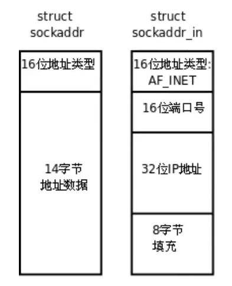

# 网络编程_回声服务器

## 套接字概念

Socket  中文意思是“插座”，在Linux环境下，用于表示进程间网络通信的特殊文件。本质为内核借助缓冲区形成的伪文件。

既然是文件， 那么理所当然的，我们可以使用文件描述符引用套接字。Linux系统将其封装成文件的目的是为了统一接口，使得读写套接字和读写文件的操作一致。区别是文件主要应用于持久化数据的读写，而套接字多用于网络进程间数据的传递。

在TCP/IP协议中，“IP地址+TCP或UDP端口号”唯一标识网络通讯中的一个进程。“IP地址+端口号”就对应一个socket。想要建立连接的两个进程各自有一个socket来标识，那么这两个socket组成的socket pair就唯一标识一个连接，因此可以用Socket来描述网络连接的一对一关系。

## 网络字节序

在计算机世界里，有两种字节序：

* 大端字节序 - 低地址高字节、高地址低字节
* 小端字节序 - 低地址低字节、高地址高字节

发送主机通常将发送缓冲区中的数据按内存地址从低到高的顺序发出，接受主机把从网络上接受到的字节依次保存在接受缓冲区中，也是按内存地址从低到高的顺序保存，因此，网络数据流的地址应这样规定：先发出的数据是低地址，后发出的数据是高地址。

**TCP/IP协议规定：网络数据流应采用大端字节序，即低地址高字节。**

例如端口号是`1001`，转化为二进制是`0000 0011 1110 1001`，十六进制是`0x03e9`，`0x03`属于是高字节,`0xe9`是低字节。网络数据流先发出的数据是低地址，按大端字节序，低地址存放高字节，所以先发出`0x03`，后发出`0xe9`。

因为网络字节序是大端序，所以主机字节序也得是大端序。但现实往往不这么理想，如果出现主机字节序是小端字节序的情况，那么传输的数据就会解析出错误的结果，所以为了网络程序具有可移植性，就需要在发送和接受数据时调用库函数做网络字节序和主机字节序的转换。

```cpp
#include <arpa/inet.h>

uint32_t htonl(uint32_t hostlong);
uint16_t htons(uint16_t hostshort);
uint32_t ntohl(uint32_t netlong);
uint16_t ntohs(uint16_t netshort);
```

h表示host（主机字节序），n表示network（网络字节序），l表示32位长整数，s表示16位短整数。

如果主机是小端字节序，这些函数将参数做相应大小端转换后返回，如果主机是大端字节序，这些函数不做转换，将参数原封不动返回。


## sockaddr地址结构

struct sockaddr很多网络编程函数诞生早于IPv4协议，那时候都使用的是sockaddr结构体，为了向前兼容，现在sockaddr退化成了`void *`的作用，传递一个地址给函数，至于这个函数是sockaddr_in还是其他的，有地址族确定，然后函数内部再强制类型转换为所需类型。



```cpp
struct sockaddr {
	sa_family 		sa_family;			// 16位地址类型
	char 			sa_data[14];		// 14字节地址数据
};

struct sockaddr_in {
	sa_family_t		sin_family;			// 16位地址类型 AF_INET
	in_port_t 		sin_port;			// 16位端口号
	struct 			in_addr sin_addr;	// 见下
};
struct in_addr {
	uint32_t 		s_addr;				// 32位IP地址
};
```

IPv4的地址格式定义在`netinet/in.h`中，IPv4地址用sockaddr_in结构体表示，包括16位端口号和32位IP地址，但是sock_API的实现早于ANSI C标准化，那时还没有`void *`类型，因此这些像bind、accpet函数的参数都用`struct sockaddr *`类型表示，在传递参数之前要强制类型转换一下，例如：

```cpp
struct sockaddr_in servaddr;
bind(listen_fd, (struct sockaddr *)servaddr, sizeof(servaddr));
```


## IP地址转换函数

```cpp
#include <arpa/inet.h>
int inet_pton(int af, const char* src, void* dst);
const char* inet_ntop(int af, const void* src, char* dst, socklen_t size);
```

`af`取值可选为`AF_INET`和`AF_INET6`，即和IPv4和IPv6对应，支持IPv4和IPv6。

其中`inet_pton`和`inet_ntop`不仅可以转换IPv4和`in_addr`，还可以转换IPv6的`in6_addr`，因此函数接口是`void*`。


## 各类函数详解


### socket函数

socket()打开一个网络通讯端口，如果成功的话，就像open()一样返回一个文件描述符，应用程序可以像读写文件一样用read/write在网络上收发数据，如果socket()调用出错则返回-1。对于IPv4，domin参数指定为AP_INET。对于TCP协议，type参数指定为SOCK_STREAM，表示面向流的传输协议。如果是UDP协议，则type参数指定为SOCK_DGRAM，表示面向数据报的传输协议。protocol参数的介绍从略，指定为0即可。

```cpp
#include <sys/types.h>
#include <sys/socket.h>

int socket(int domain, int type, int protocol);

/*
domain:
	AF_INET: 这是大多数用来参数socket的协议，使用TCP或UDP来传输，用IPv4的地址
	AF_INET6: 与上面类似，不过是用IPv6的地址
	AF_UNIX: 本地协议，使用在Unix和Linux系统上，一般都是当客户端和服务器在同一台及其上的时候使用
type:
	SOCK_STREAM: 这个协议是按照顺序的、可靠的、数据完整的基于字节流的连接。这是一个使用最多的socket类型，这个socket是按照TCP来进行传输的。
	SOCK_DGRAM: 这个协议是无连接的、固定长度的传输调用。该协议是不可靠的，使用UDP来进行连接。
	SOCK_SEQPACKET: 该协议是双线路的、可靠的连接。发送固定长度的数据包进行传输。必须把这个包完整的接受才能进行读取。
	SOCK_RAW: socket类型提供单一的网络访问，这个socket类型使用ICMP公共协议。（ping、traceroute使用该协议）
	SOCK_RDM: 这个类型是很少使用的，在大多数操作系统上没有实现，它是提供给数据链路层使用的，不保证数据包的顺序。
protocol:
	传0表示使用默认协议。
返回值:
	成功: 返回指向新创建的socket的文件描述符。
	失败: 返回-1，设置errno
*/
```


### bind函数

服务器程序所监听的网络地址和端口号是固定不变的，客户端程序得知服务器程序的地址和端口号后就可以向服务器发起连接，因此服务器需要调用bind()绑定一个固定的网络地址和端口号。

bind()的作用是将参数sockfd和addr绑定在一起，使sockfd这个用于网络通讯的文件描述符监听addr所描述的地址和端口号。前面讲过，`struct sockaddr *`，是一个通用指针类型，addr参数实际上可以接受多种协议的sockaddr结构体，而它们的长度各不相同，所以需要第三个参数addrlen指定结构体的长度。

``` cpp
#include <sys/types.h>
#include <sys/socket.h>

int bind(int sockfd, const struct sockaddr* addr, socklen_t addrlen);

/*
sockfd:
	socket文件描述符
addr:
	构造出IP地址和端口号
addrlen:
	结构体addr的长度，sizeof(addr)
返回值:
	成功返回0，失败返回-1，设置errno
*/
```

使用时需要先用bzero()函数把整个结构体server_addr清零，以免造成不必要的错误。网络地址设置为INADDR_ANY，这个宏表示本地的任意IP地址，因为服务器可能有多个网卡，每个网卡也可能绑定多个IP地址，这样设置可以在所有的IP地址上监听，直到与某个客户端建立了连接时才确定下来到底用哪个IP地址。

``` cpp
struct sockaddr_in server_addr;
bzero(&server_addr, sizeof(server_addr)); // 把标签清零，写上地址和端口号
server_addr.sin_family = AF_INET; // 选择协议族IPV4
server_addr.sin_addr.s_addr = htonl(INADDR_ANY); // 监听本地所有IP
server_addr.sin_port = htons(SERVER_PORT); // 绑定端口号
```


### listen函数

典型的服务器程序可以同时服务于多个客户端，当有客户端发起连接时，服务器调用的accept()返回并接受这个连接，如果有大量的客户端发起连接而服务器来不及处理，尚未accept的客户端就处于连接等待状态，listen()声明sockfd处于监听状态，并且最多允许有backlog个客户端处于连接状态，如果接受到更多的连接请求就忽略。

``` cpp
#include <sys/types.h>
#include <sys/socket.h>

int listen(int sockfd, int backlog);

/*
sockfd:
	socket文件描述符
backlog:
	在Linux系统中，它是指排队等待建立3次握手的队列长度
返回值:
	成功返回0，失败返回-1，设置errno
*/
```

listen()的第二个参数backlog是等待连接队列的大小，我们在设置时也要注意，设置系统的backlog大小，否则设置了比系统backlog大后，也不会有任何影响。

查看系统默认backlog

```
cat /proc/sys/net/ipv4/tcp_max_syn_backlog
```

改变系统限制的backlog大小为1024

```
vim /etc/sysctl.conf

添加
net.core.somaxconn = 1024
net.ipv4.tcp_max_syn_backlog = 1024

保存后执行
sysctl -p
```


### accept函数

三次握手完成后，服务器调用accept()函数接受连接，如果服务器调用accept()时还没有客户端的连接请求，就阻塞等待，直到有客户端连接上来。addr是一个传出参数，accept()返回时传出客户端的地址和端口号。addlen参数是传入传出参数addr结构体的长度，传出的是客户端地址结构体的实际长度。如果给addr参数传NULL，表示不关心客户端的地址。

```cpp
#include <sys/types.h>
#include <sys/socket.h>

int accept(int sockfd, struct sockaddr* addr, socklen_t* addrlen);

/*
sockfd:
	socket文件描述符
addr:
	传出参数，返回链接客户端地址信息，含IP地址和端口号
addrlen:
	传入传出参数，传入sizeof(addr)大小，函数返回真正接收到的客户端结构体大小
返回值:
	成功返回一个socket文件描述符，用于和客户端通信，失败返回-1，设置errno
*/
```


### connect函数

客户端需要调用connect()连接服务器，connect()和bind()的参数形式一致，区别在于，bind的参数是自己的地址，而connect的参数是对方的地址。

```cpp
#include <sys/types.h>
#include <sys/socket.h>

int connect(int sockfd, const struct sockaddr* addr, socklen_t addrlen);

/*
sockfd:
	socket文件描述符
addr:
	传入参数，指定服务器端地址的信息，含IP地址和端口号
addrlen:
	传入参数，传入sizeof(addr)大小
返回值:
	成功返回0，失败返回-1，设置errno
*/
```


### 出错处理函数

我们知道，系统函数调用不能保证每次都成功，必须进行出错处理，这样一方面可以保证程序逻辑正常，另一方面可以迅速得到故障信息。

``` cpp
#include <errno.h>
#include <string.h>

char* strerror(int errnum);

/*
errnum:
	传入参数，错误编号的值，一般取全局变量errno的值
返回值:
	错误原因
*/
```

``` cpp
#include <errno.h>
#include <stdio.h>

// 向标准出错stderr输出出错原因
void perror(const char* s);

/*
s:
	传入参数，自定义描述
返回值:
	无
*/
```


## 服务端代码

```cpp
#include <stdio.h>
#include <stdlib.h>
#include <unistd.h>
#include <sys/types.h>
#include <sys/socket.h>
#include <string.h>
#include <ctype.h>
#include <arpa/inet.h>

#define SERVER_PORT 666

int main() {
    // 代表信箱
    int sock;
    // 代表标签
    struct sockaddr_in server_addr;
    // 创建一个信箱
    sock = socket(AF_INET, SOCK_STREAM, 0);    
    // 把标签清零，写上地址和端口号
    bzero(&server_addr, sizeof(server_addr));
    server_addr.sin_family = AF_INET; // 选择协议族IPV4
    server_addr.sin_addr.s_addr = htonl(INADDR_ANY); // 监听本地所有IP
    server_addr.sin_port = htons(SERVER_PORT); // 绑定端口号

    // 实现标签贴到信箱上
    bind(sock, (struct sockaddr *)&server_addr, sizeof(server_addr));
	// 把信箱挂载到传达室
    listen(sock, 128);

    printf("等待客户端的连接\n");

    int done = 1;
    while(done) {
        struct sockaddr_in client;
        int client_sock, len;
        char client_ip[64];
        char buf[256];	

        socklen_t client_addr_len;
        client_addr_len = sizeof(client);
        client_sock = accept(sock, (struct sockaddr *)&client, &client_addr_len);
		// 打印客户端IP地址和端口号
        printf("client ip: %s\tport:%d\n",
            inet_ntop(AF_INET, &client.sin_addr.s_addr, client_ip, sizeof(client_ip)),
            ntohs(client.sin_port));
		// 读取客户端发送的数据
        len = read(client_sock, buf, sizeof(buf)-1);
        buf[len] = '\0';
        printf("recive[%d]: %s\n", len, buf);

        // 转换成大写
        int i;
        for(i=0; i < len; i++) buf[i] = toupper(buf[i]);
 		// 向客户端发送数据
        len = write(client_sock, buf, len);

        printf("write finished, len=%d\n", len);
        close(client_sock);	    
    }

    return 0;
}
```


## 客户端代码

```cpp
#include <stdio.h>
#include <stdlib.h>
#include <unistd.h>
#include <sys/types.h>
#include <sys/socket.h>
#include <string.h>
#include <ctype.h>
#include <arpa/inet.h>

#define SERVER_PORT 666
#define SERVER_IP "127.0.0.1"

int main(int argc, char *argv[]) {
    
    int sockfd;
    char* message;
    struct sockaddr_in serveraddr;
    char buf[64];
    int n;

    if(argc != 2) {
        fputs("Usage: ./echo_client message\n", stderr);
        exit(1);
    }

    message = argv[1];
    
    printf("message: %s\n", message);

    sockfd = socket(AF_INET, SOCK_STREAM, 0);

    memset(&serveraddr, '\0', sizeof(struct sockaddr_in));

    serveraddr.sin_family = AF_INET;
    inet_pton(AF_INET, SERVER_IP, &serveraddr.sin_addr);    
    serveraddr.sin_port = htons(SERVER_PORT);

    connect(sockfd, (struct sockaddr *)&serveraddr, sizeof(serveraddr));

    write(sockfd, message, strlen(message));
    
    n = read(sockfd, buf, sizeof(buf)-1);

    if(n > 0) {
        buf[n] = '\0';
        printf("receive: %s\n", buf);
    }else {
        perror("error!!!\n");
    }    

    printf("finished!\n");
    close(sockfd);

    return 0;
}
```

