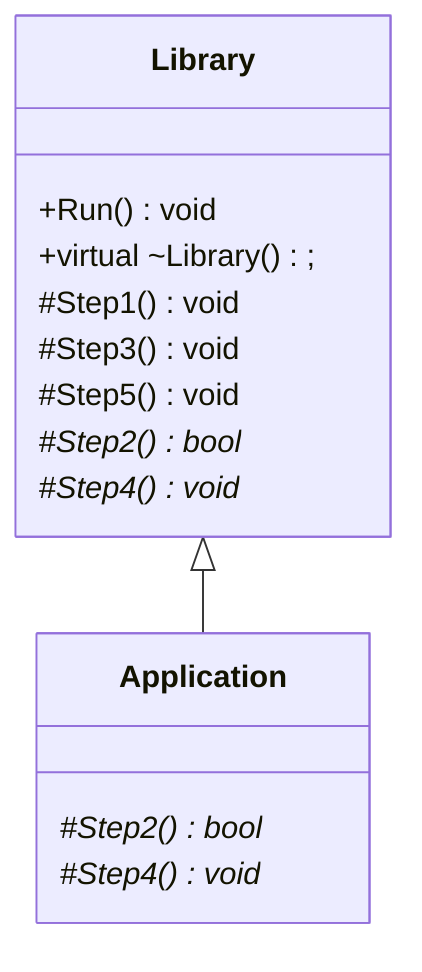

# 模板模式 (Template Method)

> 定义一个操作中的算法的骨架（稳定），而将一些步骤延迟（变化）到子类中。Template Method使得子类可以不改变（复用）一个算法的结构即可重定义（override重写）该算法的某些特定步骤。——《设计模式》GoF

## 面向对象软件设计流程

假设在程序执行过程中，需要经过5个步骤（对应1~5）。其中的1、3、5步骤是由Library开发人员开发的，其代码是稳定的，而2、4步骤是由Application开发人员开发的，其代码是变化的。

那么Library开发人员在设计时就需要将2、4步骤通过虚方法定义好对应的接口，由Application开发人员是完成实现。

同时Library开发人员也应当肩负编写程序主流程的责任，即完成步骤1~5的调用逻辑。

在以上的设计流程中，由Library开发人员编写虚函数接口的行为，被称为**晚绑定**。

## 代码实现

**详细代码：**[template_method.cpp](./template_method.cpp)

**代码结构：**

## 要点总结

* Template Method模式是一种非常基础性的设计模式，在面向对象系统中有着大量的应用。它用最简洁的机制（虚函数的多态性）为很多应用程序框架提供了灵活的扩展点，是代码复用方面的基本实现结构。
* 除了可以灵活应对子步骤的变化外，"不要调用我，让我来调用你"的反向控制结构是Template Method的典型应用。
* 在具体实现方面，被Template Method调用的虚方法可以有实现，也可以没有实现（抽象方法、纯虚方法），但一般把它们设置为protected方法。